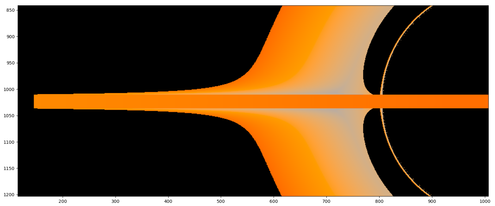

# Schwarzschild Black Hole and Accretion Disk Simulation

**Author:** Maxime S.

**Date:** 2023

A Python-based numerical simulation of a Schwarzschild black hole and its accretion disk, including photon trajectory deviation, Doppler effects, and realistic temperature distribution.

---

## 📖 Overview

This project simulates the observation of a Schwarzschild black hole and its accretion disk using numerical methods and general relativity. The simulation includes:
- Photon trajectory deviation due to gravitational lensing.
- Raytracing to generate realistic images of the black hole and disk.
- Temperature distribution modeling (black body radiation, affine and $r^{-3/4}$ laws).
- Relativistic Doppler and gravitational redshift effects.

The goal is to reproduce the visual appearance of a black hole as predicted by general relativity, and to study the physical phenomena involved.

This repository contains two reports, the original in French used for the examination and an English translation produced by Mistral AI.

---

## 🎯 Features

- **Photon Trajectories**: Numerical integration of photon paths in the Schwarzschild metric.
- **Raytracing**: Generation of 2D images from simulated photon trajectories.
- **Accretion Disk**: Modeling of the disk as a black body with realistic temperature profiles.
- **Doppler Effects**: Implementation of relativistic Doppler shift and gravitational redshift.
- **High Resolution**: Support for high-resolution images (up to 2048×2048 pixels).

---
